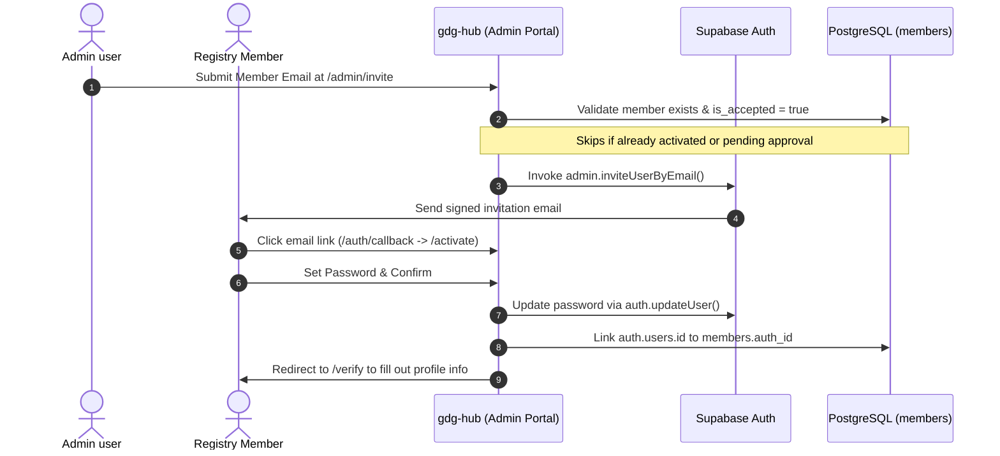
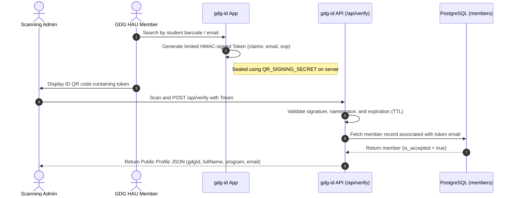

# GDG HAU Axis - Source of Truth

This directory and document serve as the absolute, single source of truth for the architecture, business logic, runtime flows, and development practices of the GDG on Campus Holy Angel University Axis Platform.

---

## 1. System Architecture

The platform is designed as a modular, type-safe monorepo utilizing **Next.js 15 (App Router)** for applications and **Turborepo** for build/cache optimization. Back-end operations are hosted on **Supabase** (PostgreSQL, Auth, Storage) and rate-limiting is handled via **Upstash Redis**.

### Monorepo Structure

```text
gdg-axis/
├── apps/                        # User-facing Next.js applications
│   ├── gdg-hub/                 # Internal management hub (Admin / Member dashboard)
│   └── gdg-id/                  # Mobile-first digital ID, lookup, and verification portal
├── packages/                    # Shared workspace packages (@hau/*)
│   ├── auth/                    # Shared session getters, RBAC roles, and authorization guards
│   ├── badges/                  # Logic for achievements & badge awarding
│   ├── certificates/            # PDF generation logic for certificates
│   ├── config/                  # ESLint and Prettier configs
│   ├── contracts/               # Zod input/output schemas & type definitions
│   ├── db/                      # Supabase client instantiation and database types
│   ├── events/                  # RSVP and attendance sync
│   ├── marketplace/             # Reward redemption rules
│   ├── points/                  # Points ledger business calculations
│   ├── pwa/                     # PWA configuration files
│   ├── types/                   # Shared typescript interfaces
│   ├── typescript-config/       # Base tsconfig targets
│   └── axis-ui/                 # Axis Design System components & styles
├── supabase/                    # Local Supabase config, migrations, and seed files
└── Source of Truth/             # System blueprints & architecture flowcharts
```

---

## 2. Core Technical Flowcharts

### Onboarding Flow (Invite-Only)



### Digital ID Search & Verification



---

## 3. Data Flow & Security Rules

### Principle of Least Privilege & Monorepo Boundaries

1. **Never Import App to App**: Under no circumstances should packages import from applications, or applications import from other applications.
2. **Access DB via `@hau/db`**: Database requests must route through `@hau/db` client instances (`createServerClientInstance` for Server Components, `createAdminClient` strictly for server-side admin privilege procedures).
3. **Data Masking**: Member lookups (`gdg-id`) must filter payloads through the `PublicMemberProfileSchema` Zod model to strip private data (e.g. `student_id`).
4. **JWT Verification**: The verification token is signed with a SHA256 HMAC utilizing `QR_SIGNING_SECRET`. The secret must remain server-side.
5. **CSRF & Rate-Limiting**:
   - CSRF protection is active on state-changing requests.
   - Public-facing endpoints (`/api/search`, `/api/verify`) are rate-limited via sliding-window limiters.

---

## 4. Development Workflow

- Run validation tools locally before pushing code.
- Ensure PostgreSQL changes are written as SQL migrations in `supabase/migrations/`.
- Ensure all packages declare their internal dependencies in `package.json` using `workspace:*`.
