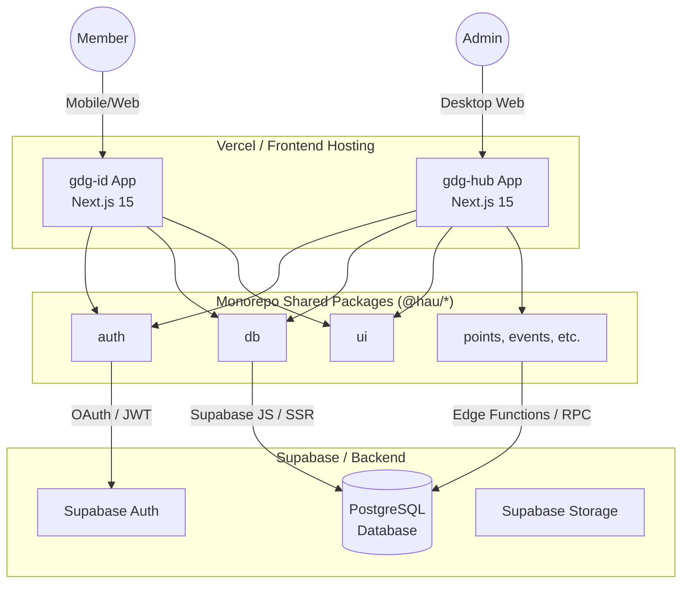

# System Overview

The GDG HAU Axis platform is designed as a modern, decoupled, serverless-first architecture optimized for performance, type safety, and developer velocity.

## High-Level Architecture Diagram

## Core Infrastructure

### Frontend & API Layer

Both `gdg-id` and `gdg-hub` are built using **Next.js 15 (App Router)**.

- **Server Components:** We heavily utilize React Server Components (RSC) to fetch data directly from the database without creating intermediate API endpoints.
- **Server Actions:** Form submissions and data mutations are handled via Next.js Server Actions, providing end-to-end type safety from the UI down to the database schema.
- **Hosting:** Deployed to **Vercel** for global edge caching and seamless CI/CD.

### Shared Logic & UI

The Turborepo structure allows us to keep the apps thin.

- **UI:** A shared `@hau/axis-ui` design-system package provides Tailwind-styled, application-agnostic primitives for both apps.
- **Business Logic:** Domain-specific logic (e.g., how points are calculated) is encapsulated in separate packages like `@hau/points` and `@hau/db` to guarantee that both apps interact with the database identically.

### Backend & Database

We utilize **Supabase** as our complete backend-as-a-service.

- **PostgreSQL:** The core database. We define all tables, views, and Row Level Security (RLS) policies here.
- **Auth:** Handles Google OAuth, email/password logins, and session management. JWTs are securely passed to Next.js via cookies using `@supabase/ssr`.
- **Storage:** Used to store user avatars, dynamically generated PDF certificates, and ID card assets.
