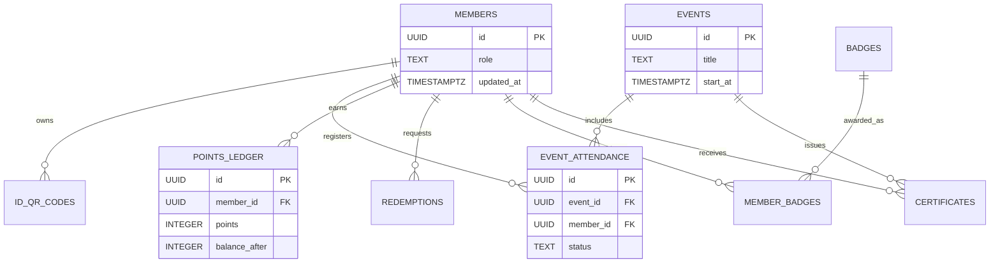

# Database Schema Overview

The GDG HAU Axis platform relies on a robust relational PostgreSQL database hosted on Supabase.

The schema is designed to ensure referential integrity (using foreign keys and cascading deletes) and to handle data changes safely (using automatic `updated_at` triggers).

## High-Level Domain Model

The database can be conceptually divided into four domains:

1. **Identity & Profiles**
   - Core tables defining who a user is.
   - Tables: `members`, `member_credentials`, `id_qr_codes`. Profile fields are stored on `members`.

2. **Events & Engagement**
   - Tables tracking what is happening and who is attending.
   - Tables: `events`, `event_attendance`.

3. **Gamification & Rewards**
   - Tables handling the economy of GDG HAU.
   - Tables: `points_ledger`, `redemptions`, `badges`, `member_badges`.

4. **System Logs & Notifications**
   - Tables handling auditing and member messaging.
   - Tables: `notifications`, `audit_logs`, `verification_logs`, `app_settings`.

## Entity Relationship Diagram (ERD)

*Note: This is a simplified diagram. For the exhaustive list of columns and relationships, refer to the [Tables Data Dictionary](tables.md).*
